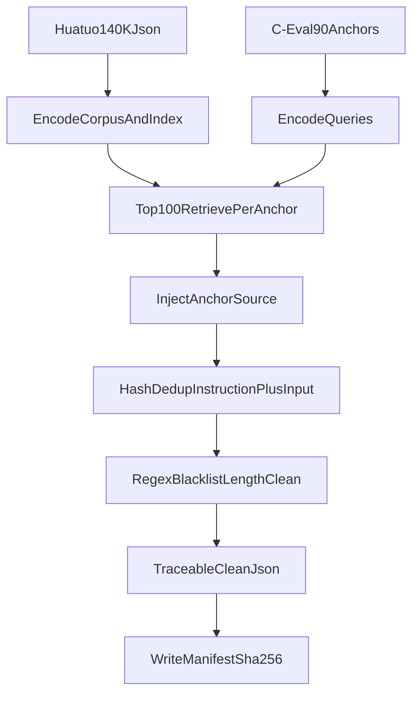

# SFT 构建方案

## 结论
按当前文档，推荐采用“主入口 + 辅助模块”的实现，而不是把所有逻辑堆进单个大文件。

- 主入口放在 [`/root/projects/MedicalGPT/my_data_process/build_sft_dataset.py`](/root/projects/MedicalGPT/my_data_process/build_sft_dataset.py)
- 继续复用已有的 C-Eval 下载脚本 [`/root/projects/MedicalGPT/my_data_process/download_ceval_val.py`](/root/projects/MedicalGPT/my_data_process/download_ceval_val.py)
- 参考设计文档 [`/root/projects/MedicalGPT/my_docs/data_process.md`](/root/projects/MedicalGPT/my_docs/data_process.md)

## 推荐数据流

## 关键判断
- 不需要把两个数据集都做成完整离线向量库。
- 只需要对候选库做离线向量化/索引；90 个 C-Eval 锚点运行时编码即可，必要时只缓存这 90 个向量。
- 原因是文档定义的是“90 个锚点在 140K 候选库上做 Top-100 检索”，不是“双库对等匹配”。

## 实现拆分
建议在 `my_data_process` 下拆成 4 个辅助模块，由 `build_sft_dataset.py` 统一调度：

- `retrieval.py`：加载 `bge-large-zh-v1.5`，构建或读取候选库向量，执行 Top-K 检索并注入 `anchor_source`
- `dedup.py`：对 `instruction + input` 计算 SHA-256，做绝对去重
- `cleaning.py`：做空字段、长度、HTML 标签、黑名单词过滤
- `manifest.py`：对最终产物计算文件级 SHA-256，写 `manifest.json`

如果你更想先快速跑通，也可以先不拆 4 个文件，而是在主脚本内部保留这 4 组清晰函数，后续再抽模块。

## 主要输入输出
- 输入候选库：`/root/autodl-tmp/raw_data/HuatuoGPT2-GPT4-140K.json`
- 输入锚点：由 C-Eval 医疗子集整理出的 90 个问题文本
- 中间结果目录：`/root/autodl-tmp/processed_data/`
- 最终输出：`sft_v1_traceable_clean.json`
- 档案输出：`manifest.json`

## 落地顺序
1. 先确定 Huatuo 140K 的真实字段结构，明确用于编码与去重的文本拼接规则。
2. 在 `build_sft_dataset.py` 里先写 CLI 参数和流水线骨架。
3. 实现候选库编码与索引缓存，支持首次构建、后续复用。
4. 实现 90 个锚点查询编码与 Top-100 召回，并写入 `anchor_source`。
5. 实现 Hash 去重、正则清洗、长度检查。
6. 产出最终 JSON，并写入 `manifest.json`。
7. 如训练端需要，再补一道格式转换/校验，和仓库现有 `jsonl` 工具链对齐。